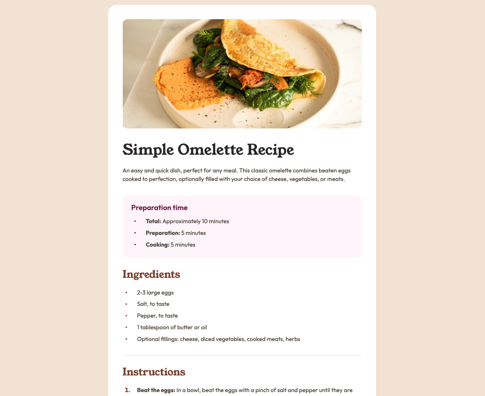

# Frontend Mentor - Recipe page solution

This is a solution to the [Recipe page challenge on Frontend Mentor](https://www.frontendmentor.io/challenges/recipe-page-KiTsR8QQKm). Frontend Mentor challenges help you improve your coding skills by building realistic projects.

## Table of contents

- [Overview](#overview)
  - [The challenge](#the-challenge)
  - [Screenshot](#screenshot)
  - [Links](#links)
- [My process](#my-process)
  - [Built with](#built-with)
- [Author](#author)
- [Acknowledgments](#acknowledgments)

**Note: Delete this note and update the table of contents based on what sections you keep.**

## Overview

### Screenshot

### Links

- [Solution URL here](https://www.frontendmentor.io/solutions/recipe-page---vanilla-html-css-CG52R2JTPq)
- [Live Site URL here](https://jeremdevx.github.io/fm-challenge-recipe-page/)

## My process

### Built with

- Semantic HTML5 markup
- CSS custom properties
- Flexbox

## Author

- Website - [JeremDevX](https://jeremdevx.com)
- Frontend Mentor - [@JeremDevX](https://www.frontendmentor.io/profile/JeremDevX)
- Twitter - [@JeremDevX](https://x.com/JeremDevX)
